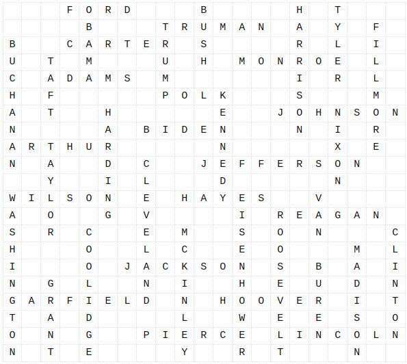

# Presidential Rectangle

The Presidential Rectangle puzzle asks for a packing of all U.S. presidential surnames into the smallest possible rectangle subject to the following conditions:

   * Names can only be placed left-to-right or top-to-bottom
   * Letters in adjacent cells must belong to a common name
   * Every name must be connected by some path of intersecting names to every other name

You can read more background about the puzzle and these tools in [this post](https://blog.aaw.io/2021/11/07/the-presidential-rectangle.html).

Here's a 21-by-21 solution for the current set of 40 presidential surnames, as of 2021:



## Setup

You'll need a SAT solver that accepts DIMACS CNF files as input. I'll use [kissat](https://github.com/arminbiere/kissat.git) in
examples below. You'll also need python3 installed.

## Examples

The workflow is basically:

   1. Generate a DIMACS CNF file with appropriate constraints
   2. Find a solution or prove one doesn't exist with a SAT solver
   3. Extract a solution if one exists, otherwise try again

The Presidential Rectangle seems too difficult to solve directly, so these tools allow you to specify many more types of contstraints to zero in
on specific solutions. First, to illustrate the workflow, here's how you'd find the smallest rectangle containing the words ZERO, ONE, ..., TEN:

```
# Generate constraints for an 8-by-8 rectangle containing words from data/numbers-10:
$ generate-sat.py data/numbers-10 8 8 > /tmp/numbers.cnf

# Run a SAT solver on the input, store the output.
# (This might take a minute, tail the output for progress.)
$ kissat /tmp/numbers.cnf > /tmp/numbers.out

# Was the solver successful? Exit code is 10 for success, 20 for failure:
$ echo $?
10

# Since the solver was successful, you can extract the discovered 8-by-8 solution:
$ decode-solution.py /tmp/numbers.cnf /tmp/numbers.out 8 8
  FIVE
TWO  I
  U  G
ZERO H
   N TEN
SEVEN  I
I      N
X  THREE

# You can also prove that such a packing is impossible in a 7-by-7 rectangle:
$ generate-sat.py data/numbers-10 7 7 > /tmp/numbers.cnf
$ kissat /tmp/numbers.cnf > /tmp/numbers.out
$ echo $?
20
```

With the basics out of the way, you're ready to move on to the full Presidential
Rectangle. The `data` subdirectory contains two lists of presidents:

   * [presidents-38](data/presidents-38): the first 38 distinct presidential surnames
   * [presidents-40](data/presidents-40): all 40 current (as of 2021) presidential surnames

Neither of these can be solved directly using the straightforward approach shown
above for the numbers ZERO through TEN in less than a week with current SAT solvers.
Instead, you'll have to do some work on your own and feed the solver hints to give
it a more constrained problem to work with. These tools support a few such hints.

### Forces

To force the placement of words in the rectangle, provide a newline-delimited
file containing these forces with the `--forcefile` option.

Forces are specified by the word, followed by a colon, followed by `H` or `V` (for
horizontal or vertical placement), followed by the origin of the word. Example:

```
BUCHANAN:V(0,0)
ARTHUR:H(6,0)
HARDING:V(4,5)
TAYLOR:V(6,2)
```

The above forces will fix BUCHANAN vertically starting from row 0, column 0,
ARTHUR horizontally starting from row 6, column 0, and so on.

It's up to you to make sure the forces make sense. If you try to force two words
to cross in letters that don't match, for example, `generate-sat.py` will still
generate an input file with those constraints but the solver will tell you it's
unsatisfiable.

### Relative forces

Forces might be too strict for your needs if you just care about relative positioning
of a set of words. For example, you might want HARDING and HARRISON to intersect
in H's but not care which is horizontal and which is vertical or where they
appear in the rectangle.

You can provide a newline-delimited set of relative forces like these with the
`--relforcefile` option. Example:

```
ROOSEVELT:2:OBAMA:0
ROOSEVELT:4:CLEVELAND:4
ROOSEVELT:6:JEFFERSON:4
```

The relative forces above will ensure that:

   * ROOSEVELT and OBAMA intersect in ROOSEVELT's second O (position 2) and OBAMA's first O (position 0)
   * ROOSEVELT and CLEVELAND intersect in ROOSEVELT's first E and CLEVELAND's second E
   * ROOSEVELT and JEFFERSON intersect in ROOSEVELT's second E and JEFFERSON's second E

### Subsets of words

Instead of requiring all words be packed into the rectangle, you can pass an integer
to the `--lowerbound` flag to allow at least that number of words packed.

### Empty cells

The `--lowerbound` constraint is often not sufficient to get a good partial packing by
itself since the solver will find it easier to pack the _N_ shortest words than the
_N_ longest words. You can require a maximum number of empty cells to further coerce
the solver to place longer words by passing an integer to the `--empty` flag.

### Blocking solutions

If you've found one solution to a set of constraints and you want to continue finding
more, you'll need to block the solution from the solver to force it to find others.
You can do this with the `block.py` script, which generates a single clause that can
be appended to the input file to exclude the current solution.

Example:

```
$ generate-sat.py data/numbers-10 8 8 > /tmp/numbers.cnf
$ kissat /tmp/numbers.cnf > /tmp/numbers.out
$ decode-solution.py /tmp/numbers.cnf /tmp/numbers.out 8 8
  FIVE
TWO  I
  U  G
ZERO H
   N TEN
SEVEN  I
I      N
X  THREE

$ block-solution.py /tmp/numbers.cnf /tmp/numbers.out
-1952 -1269 -1419 -1536 -1732 -1814 -1495 -1921 -1168 -1703 -1297 0

# Append the output line above to /tmp/numbers.cnf
# to block the first solution.
$ block-solution.py /tmp/numbers.cnf /tmp/numbers.out >> /tmp/numbers.cnf

# Now solve again (We've added a clause without updating the number
# of clauses in the DIMACS header, which is why we need --relaxed.)
$ kissat --relaxed /tmp/numbers.cnf > /tmp/numbers.out
$ decode-solution.py /tmp/numbers.cnf /tmp/numbers.out 8 8
   F  F
ZERO SIX
 I U  V
 G R TEN
 H   H I
 TWO R N
   N E E
  SEVEN
```
